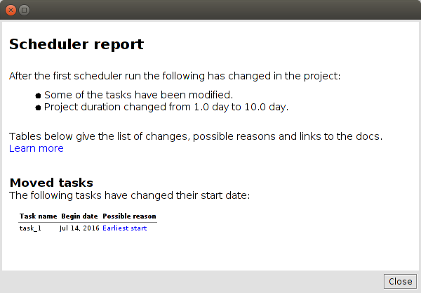

This history starts from GanttProject 2.8.
You can find [previous history](http://www.ganttproject.biz/about) on the main web site.

## GanttProject 2.8 Pilsen

GanttProject 2.8 "Pilsen" is an evolution of the previous [GanttProject 2.7 "Ostrava"](http://ganttproject.biz/ostrava).
It makes working [Early Begin constraint](/scheduler)  in the scheduler and fixes a number of bugs and usability issues.

### GanttProject 2.8 Release and Maintenance Updates

Date           | Release
:------------- | :------------------------------------
Jul 26, 2016   | [GanttProject 2.8](https://www.ganttproject.biz/pilsen)
Aug 5, 2016    | [GanttProject 2.8.1](https://github.com/bardsoftware/ganttproject/releases/tag/ganttproject-2.8.1)
Feb 21, 2017   | [GanttProject 2.8.2](https://github.com/bardsoftware/ganttproject/releases/tag/ganttproject-2.8.2)
Mar 6, 2017    | [GanttProject 2.8.3](https://github.com/bardsoftware/ganttproject/releases/tag/ganttproject-2.8.3)
Mar 24, 2017   | [GanttProject 2.8.4](https://github.com/bardsoftware/ganttproject/releases/tag/ganttproject-2.8.4)
May 19, 2017   | [GanttProject 2.8.5](https://github.com/bardsoftware/ganttproject/releases/tag/ganttproject-2.8.5)
Feb 9, 2018    | [GanttProject 2.8.6](https://github.com/bardsoftware/ganttproject/releases/tag/ganttproject-2.8.6)
Apr 17, 2018   | [GanttProject 2.8.7](https://github.com/bardsoftware/ganttproject/releases/tag/ganttproject-2.8.7)
May 21, 2018   | [GanttProject 2.8.8](https://github.com/bardsoftware/ganttproject/releases/tag/ganttproject-2.8.8)
Aug 21, 2018   | [GanttProject 2.8.9](https://github.com/bardsoftware/ganttproject/releases/tag/ganttproject-2.8.9)

## Headlines

The major new feature is actually pretty old one which has been made working. We had so called "additional constraint"
called [early begin](/scheduler) in task properties for years, and its meaning was pretty vague,
mostly because this constraint didn't work.

As of 2.8 this constraint made working and it has clear semantics: task with early begin constraint set to some date X
will be scheduled to start no earlier than X and as close to X as possible, provided that other constraints permit that.

The obvious use of this constraint is to set the earliest date when a task can start. For instance, if task begin date was
set on July 5 then changing its earliest start constraint to July 14 will move task to the future.

However, there is another use case which is now possible: you can use it as "planned start date", as opposed to the real start date set by
the scheduler. If task had initially start date and earliest start constraint set to July 14,
and was moved to some later date because of finish-start dependencies on other tasks then removing the dependencies will move
the task back to July 14.

## Scheduler Audit and Report

Since Early Begin constraint is now enforced, older projects where it was set and probably forgotten
may be affected. When opening older projects GanttProject audits the first run of the scheduler and
reports the results to user if at least one task changes its dates after the first run. Scheduler Report
looks as follows:

If your project is fine and the scheduler has made no changes, you'll see no report. Otherwise the report shows up
a couple of seconds after file has been opened and you need to inspect the changes made by the scheduler.

## Other changes

There is a number of other [important bugfixes](https://github.com/bardsoftware/ganttproject/milestones/2.8)
in GanttProject 2.8. Korean translation has been significantly improved thanks to the
efforts of [*ihavnoth*](https://crowdin.com/profile/ihavnoth),
and other translations have also been updated.

Distribution for Ubuntu and other Debian-based Linux systems which registers MIME type and file associations have changed
MIME type from `application/ganttproject+xml` to `application/x-ganttproject`. The latter apparently already comes by default with
Ubuntu so no reason to use the former anymore.

Maintenance updates fixed most of High-DPI compatibility issues and 
added a new feature: [sorting of tasks by begin/end dates](http://ganttproject.blogspot.com/2017/05/ganttproject-285-task-sorting.html)

## Compatibility

File format has slightly changed: we removed redundant information about the configuration columns shown in the task table.
Files produced by [GanttProject 2.7](http://ganttproject.biz/ostrava) should open fine in GanttProject 2.8.
Files produced by GanttProject 2.8 can be opened in [GanttProject 2.7](http://ganttproject.biz/ostrava), except that only
Name, Begin date and End date columns will be shown in the task table by default, no matter what is written in the project file.

## System requirements

* Any reasonably modern computer with reasonably modern OS capable of running Java applications is fine for running GanttProject.
Please refer to information from Oracle or from your platform vendor about Java Runtime compatibility with your operating system.
* We recommend using [Java 8](http://www.oracle.com/technetwork/java/javase/downloads/jre8-downloads-2133155.html)
for running GanttProject, but other versions, starting from [Java 7](http://www.oracle.com/technetwork/java/javase/downloads/jre7-downloads-1880261.html)
and higher, up to the latest Java 11, are also fine.
* Android and iOS are not supported. On Android you may try using [Ganttman app](https://ganttman.com)
which is file-wise compatible with GanttProject up to some extent.
